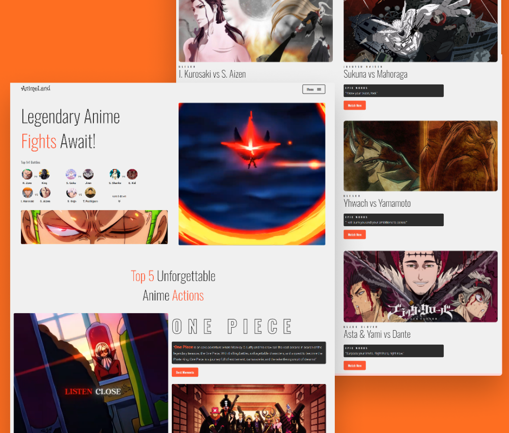

# AnimeLand

    

## About 🚀
- **Anime Land** is a website dedicated to showcasing the most unforgettable anime fights and action-packed moments! Whether you're a fan of intense 1 vs 1 battles or jaw-dropping key scenes, this site has it all. I combined my love for anime with web development to bring these epic moments to life.

## Technologies 🛠️
- `Sass`
- `React`
- `Framer Motion`

## Features 💡
- Showcase of Legendary Anime Fights: Highlights the most memorable and action-packed 1 vs 1 battles and iconic moments from popular anime series like One Piece, Bleach, and Dragon Ball Super.
- Top Action Moments: Provides a curated list of the best anime action scenes, giving visitors an overview of unforgettable sequences from various series.
- Responsive Design: Ensures the page looks great and functions well on all devices, including desktops, tablets, and smartphones.
- Interactive Elements: Smooth animations and transitions that enhance the user experience without overwhelming the visitor.

## Project Process 📚
1. Inspiration:I gather inspiration from various sources to understand the latest design trends and user preferences.
2. Wireframing: Using Figma, I create wireframes to outline the structure and layout of the website.
3. Design: I develop detailed designs based on the wireframes, ensuring a cohesive and visually appealing user experience.
4. Development: I bring the design to life through code, focusing on creating a responsive and functional website.

## Running the Project 🚦
1. Clone the repository to your machine. `https://github.com/mounirabcire/AnimeLand.git`

2. Install dependencies: `cd AnimeLand`  `npm install`

3. Open up your live server

4. Open up your browser

## Demo 📸
- You can start exploring the app here: [AnimeLand](https://anime-land-ten.vercel.app/ "AnimeLand")